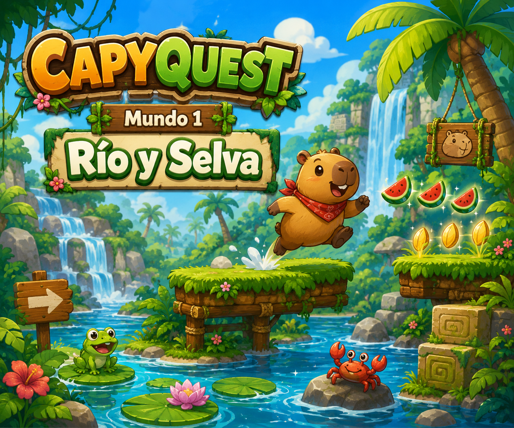

# CapyQuest: El Rio Perdido


Juego de plataformas 2D hecho con Phaser donde controlas a **Capi** para recuperar semillas doradas y liberar el rio.

## De que trata el juego

- Recorres 2 mundos principales: rio/selva y ruinas del volcan.
- Superas niveles con plataformas moviles, trampas, enemigos y secciones de escape vertical.
- Coleccionas sandias y semillas doradas para subir puntaje.
- Enfrentas jefes (como Jaguar y Condor) hasta llegar al final.

## Stack usado

- `TypeScript`
- `Phaser 3`
- `Vite`
- `Capacitor` (`@capacitor/core`, `@capacitor/android`)
- `Android Studio` + Gradle para empaquetar APK

## Galeria




## Controles (teclado)

- `A / D` o `Flechas izquierda/derecha`: mover
- `W` o `Flecha arriba` o `Espacio`: saltar
- `Enter`: iniciar

## Ejecutar en local

1. Instala dependencias:

```bash
npm install
```

2. Levanta el proyecto en modo desarrollo:

```bash
npm run dev
```

3. Compila build de produccion:

```bash
npm run build
```

## Como instalarlo en Fire TV

> Requisitos: Fire TV y tu PC en la misma red, `ADB` instalado, y **Apps from Unknown Sources** habilitado en Fire TV.

1. Compila el proyecto web:

```bash
npm install
npm run build
```

2. Sincroniza archivos web a Android (Capacitor):

```bash
npx cap sync android
```

3. Genera el APK debug:

```bash
cd android
.\gradlew assembleDebug
```

4. Ubica el APK generado en:

`android/app/build/outputs/apk/debug/app-debug.apk`

5. En Fire TV:
- Ve a `Settings > My Fire TV > Developer Options`.
- Activa `ADB Debugging`.

6. Obtén la IP de Fire TV:
- `Settings > My Fire TV > About > Network`.

7. Instala por ADB desde tu PC:

```bash
adb connect TU_IP_FIRETV
adb install -r android/app/build/outputs/apk/debug/app-debug.apk
```

8. Abre la app en Fire TV (aparece con el nombre `capyquest-rio-perdido`).

## Reportar bugs

Si encuentras un bug, abre un **Issue** en GitHub desde la pestana **Issues** del repo y agrega:

- Modelo de Fire TV (o dispositivo) y version del sistema
- Version del juego (commit/tag si aplica)
- Pasos exactos para reproducir el problema
- Resultado esperado vs resultado actual
- Captura o video del bug
- Logs si tienes `adb logcat`

Plantilla sugerida:

```md
### Descripcion

### Pasos para reproducir
1.
2.
3.

### Resultado esperado

### Resultado actual

### Entorno
- Dispositivo:
- SO:
- Version del juego:
```

