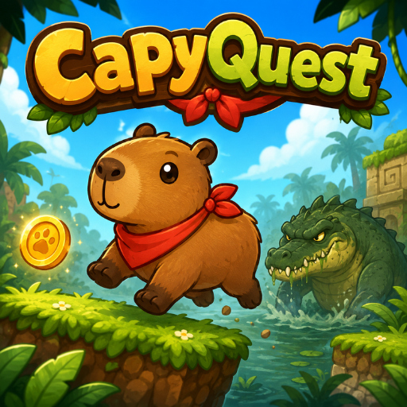

# CapyQuest: El Río Perdido



**CapyQuest: El Río Perdido** es un juego de plataformas 2D hecho con Phaser, donde controlas a **Capi** para recuperar semillas doradas, recolectar sandías y liberar el río.

---

## Descargar y probar el juego

Puedes descargar la última versión del APK desde la sección de **Releases**:

👉 [Descargar última versión](https://github.com/tartuzet/capyquest/releases/latest)

También puedes descargar directamente la versión beta actual:

👉 [Descargar CapyQuest v0.1.0 beta](https://github.com/tartuzet/capyquest/releases/download/v0.1.0-beta/capyquest-v0.1.0-beta.apk)

> Esta es una versión beta. Puede tener errores, detalles visuales o ajustes pendientes.

---

## Cómo instalarlo en Android o Fire TV

### Android

1. Descarga el archivo `.apk`.
2. Activa la instalación de apps desconocidas si el sistema lo solicita.
3. Instala el APK.
4. Abre el juego.

### Fire TV

La forma más sencilla es usar la app **Downloader** en Fire TV:

1. Instala **Downloader** desde la tienda de apps de Fire TV.
2. Abre Downloader.
3. Pega o escribe el enlace directo del APK.
4. Descarga e instala el juego.
5. Abre CapyQuest desde tus apps.

APK actual:

```txt
https://github.com/tartuzet/capyquest/releases/download/v0.1.0-beta/capyquest-v0.1.0-beta.apk